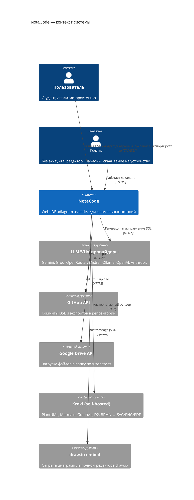
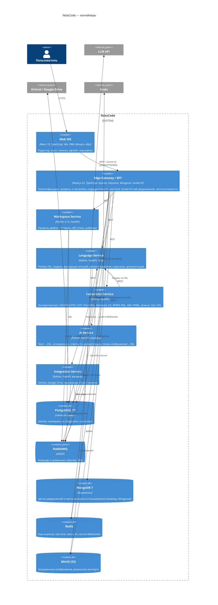
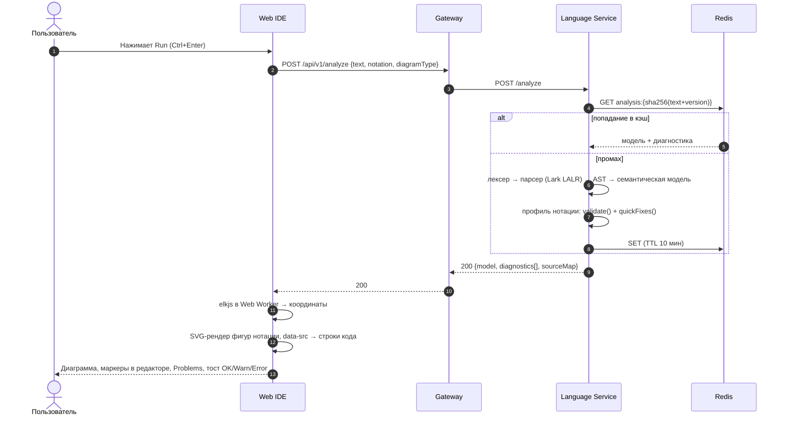
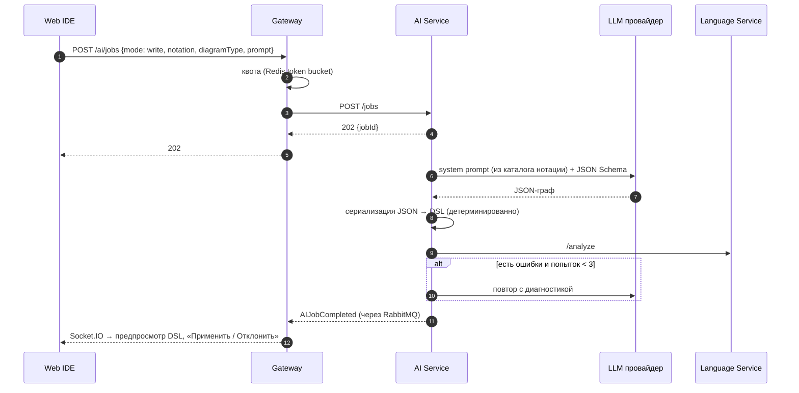
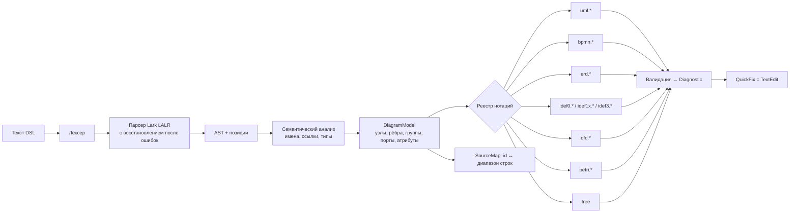
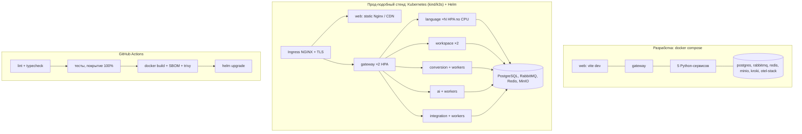

# Архитектура NotaCode

Статус: **черновик v0.1** (23.09.2026). Раздел про лабы ИТиВП уточняется после разбора `E:\ИТиВП`.

Документ описывает архитектуру по модели C4 (Simon Brown): контекст → контейнеры → компоненты → код. Решения зафиксированы в ADR ([adr/](adr/)). Литература: [../literature/](../literature/).

---

## 1. Архитектурные драйверы

Архитектура выбирается по характеристикам (Richards & Ford), а не по моде. Эти требования сильнее всего влияют на структуру:

| # | Драйвер | Откуда | Что из него следует |
|---|---|---|---|
| D1 | Мгновенная обратная связь «код → диаграмма → ошибки» (≤ 300 мс для 200 узлов) | ТЗ, MVP | Разбор и валидация — отдельный быстрый stateless-сервис; раскладка и отрисовка на клиенте |
| D2 | Много строгих нотаций с правилами (UML ×14, BPMN ×4, ERD, IDEF0/1X/3, DFD, Петри ×N) | ТЗ | Ядро языка отделено от нотаций; нотация — это плагин (Open/Closed) |
| D3 | Медленные и ненадёжные внешние системы (LLM, GitHub, Google Drive, Kroki) | ТЗ | Асинхронные очереди, Circuit Breaker, Bulkhead, повторы, идемпотентность (Nygard) |
| D4 | История версий уровня Git, diff, откат | ТЗ | Неизменяемые коммиты (DAG), content-addressed blobs (Pro Git), append-only |
| D5 | Распределённое enterprise-приложение | пожелание автора | Отдельно разворачиваемые сервисы по ограниченным контекстам (DDD) и событийная интеграция |
| D6 | Требования лаб ИТиВП (Node.js-сервер, React, тесты, деплой, мониторинг) | методички | Node.js закрывает свою реальную роль — edge/BFF; остальное на Python |
| D7 | 100% покрытие, ноль комментариев, Clean Code | пожелание автора | Чистое доменное ядро без фреймворков; порты и адаптеры; маленькие функции |
| D8 | Работа офлайн (PWA) | ТЗ | Черновики и очередь команд в IndexedDB, синхронизация при появлении сети |
| D9 | Безопасность (XSS в SVG, ключи, OAuth-токены) | аудит старых версий | Экранирование на сервере и санитизация на клиенте, секреты только на сервере, шифрование токенов |

## 2. Архитектурный стиль: сервисная архитектура (service-based) с событиями

Рассмотрены три стиля.

| Стиль | Плюсы | Минусы для NotaCode | Итог |
|---|---|---|---|
| Монолит (в т.ч. модульный) | Проще всего | Тяжёлые LLM-вызовы и рендер делят ресурсы с API; не выполняет D5 | Нет |
| Микросервисы (15+ мелких) | Максимальная независимость | Newman и Fowler («MonolithFirst») предупреждают: без зрелых границ это распределённый монолит. Огромная стоимость эксплуатации | Нет |
| **Service-based + event-driven** | 6 крупных сервисов по контекстам DDD, независимые деплой и масштабирование, изоляция отказов, асинхронность там, где она нужна | Нужны брокер, outbox и наблюдаемость | **Да** |

Правила стиля:

- Один сервис — один ограниченный контекст — своя схема БД. Чужие таблицы не читаем: только API или события (Newman, «database per service»).
- Синхронные вызовы — только когда пользователь ждёт ответа (Run, открыть файл). Всё остальное — события.
- Каждое событие публикуется через **transactional outbox**, каждый потребитель **идемпотентен** (Richardson, Kleppmann).
- Внутри каждого сервиса — **Clean/Hexagonal Architecture**: `domain` ← `application` ← `adapters`, зависимости направлены внутрь (Martin, Cosmic Python).
- 12-factor: конфигурация через окружение, логи в stdout, stateless-процессы.

## 3. C4, уровень 1: контекст системы



## 4. C4, уровень 2: контейнеры



### 4.1 Ответственность контейнеров

| Контейнер | Контекст DDD | Владеет данными | Почему отдельно |
|---|---|---|---|
| **Web IDE** | UI | IndexedDB: черновики, настройки раскладки, офлайн-очередь | Раскладка и отрисовка на клиенте дают D1 и интерактивность в стиле draw.io |
| **Edge Gateway/BFF** (Node.js, Express) | Identity & Access, Notifications | PostgreSQL `identity` (Sequelize): users, credentials, refresh_tokens, settings, linked_accounts; MongoDB (Mongoose): notifications, activity | Паттерн BFF/API Gateway (Newman, Richardson): единая точка входа и безопасность; I/O-bound — сильная сторона Node; закрывает лабы ч.2: Express (ЛР1), Sequelize (ЛР2), JWT (ЛР3), MongoDB (ЛР6), Socket.IO (ЛР7), Docker (ЛР8) |
| **Workspace** | Моделирование документов и версий | `workspace`: projects, files, blobs, commits, refs, templates, outbox | Ядро бизнес-данных; строгая транзакционность |
| **Language** | Язык и нотации | нет (stateless), кэш в Redis | CPU-bound, горизонтально масштабируется; чистое ядро, которое легко покрыть тестами на 100% |
| **Conversion** | Форматы и рендер | `conversion`: jobs | Тяжёлые форматы (PNG/PDF, Kroki) не блокируют API |
| **AI** | AI-ассистент | `ai`: requests, prompt_templates | Медленные и дорогие внешние вызовы; квоты; Bulkhead |
| **Integration** | Внешние хранилища | `integration`: connections (шифр.), sync_targets, sync_jobs | Токены OAuth изолированы от остальных сервисов; повторы и Circuit Breaker |

## 5. Ключевые сценарии (динамика)

### 5.1 Run: код → диаграмма (синхронно, быстрый путь)



### 5.2 Сохранение с синхронизацией в GitHub (асинхронно)

```mermaid
sequenceDiagram
autonumber
actor U as Пользователь
participant W as Web IDE
participant G as Gateway
participant S as Workspace
participant Q as RabbitMQ
participant I as Integration
participant GH as GitHub API
U->>W: Save ▸ GitHub
W->>G: POST /files/{id}/commits {text, message, target: github}
G->>S: POST /commits (Idempotency-Key)
S->>S: blob=sha256(text); commit(parent=head); outbox(CommitCreated)
S-->>G: 201 {commitId}
G-->>W: 201 → тост «Сохранено»
S->>Q: CommitCreated (outbox relay)
Q->>I: CommitCreated
I->>GH: PUT /repos/{o}/{r}/contents/{path}
alt успех
  I->>Q: SyncSucceeded
else ошибка / лимит
  I->>I: повтор с экспоненциальной задержкой → DLQ
  I->>Q: SyncFailed
end
Q->>G: SyncSucceeded / SyncFailed
G-->>W: Socket.IO push → статус-бар «Pushed 14:05» / тост Error
```

### 5.3 AI: текст → DSL (асинхронно, с самопроверкой)



## 6. Модель данных (логическая)

```mermaid
erDiagram
  USER ||--o{ PROJECT : owns
  USER ||--o{ LINKED_ACCOUNT : links
  USER ||--|| USER_SETTINGS : has
  PROJECT ||--o{ FILE : contains
  FILE ||--o{ COMMIT : history
  COMMIT }o--|| BLOB : snapshot
  COMMIT |o--o| COMMIT : parent
  FILE ||--|| REF : head
  FILE ||--o{ SYNC_TARGET : "sync to"
  SYNC_TARGET ||--o{ SYNC_JOB : runs
  FILE ||--o{ AI_REQUEST : "generated by"
  FILE ||--o{ EXPORT_JOB : exports
  TEMPLATE }o--|| NOTATION_KEY : for
  USER { uuid id PK; text email UK; text password_hash; timestamptz created_at }
  USER_SETTINGS { uuid user_id PK; text theme; text ui_language; bool auto_render; bool auto_save; int tab_size; text encoding }
  LINKED_ACCOUNT { uuid id PK; uuid user_id FK; text provider; bytea token_ciphertext; timestamptz expires_at }
  PROJECT { uuid id PK; uuid owner_id; text name; timestamptz created_at }
  FILE { uuid id PK; uuid project_id FK; text path; text notation; text diagram_type; text level; timestamptz deleted_at }
  BLOB { char64 sha256 PK; text content; int size }
  COMMIT { uuid id PK; uuid file_id FK; uuid parent_id FK; char64 blob_sha FK; text author_kind; uuid author_id; text message; jsonb stats; timestamptz created_at }
  REF { uuid file_id PK; uuid commit_id FK }
  SYNC_TARGET { uuid id PK; uuid file_id FK; text kind; text location; text format }
  SYNC_JOB { uuid id PK; uuid target_id FK; uuid commit_id; text status; int attempts; text error }
  AI_REQUEST { uuid id PK; uuid file_id; text mode; text provider; text model; text prompt; text output_dsl; text status; int latency_ms }
  EXPORT_JOB { uuid id PK; uuid file_id; text format; text engine; text status; text object_key }
  TEMPLATE { uuid id PK; text notation_key; text title; text content; bool builtin }
```

Правила:

- `COMMIT` и `BLOB` неизменяемы. Откат — это новый коммит со старым `blob_sha` (как `git revert`), история не теряется.
- `stats` хранит количество узлов, рёбер и ошибок для списка версий.
- Каждая схема принадлежит одному сервису. `USER*` и `LINKED_ACCOUNT` лежат в `identity` (Gateway) и `integration`, `PROJECT..TEMPLATE` — в `workspace`.

## 7. Язык и нотации (Language Service изнутри)



- Иерархия каталога: **Нотация → Тип диаграммы → Вариант/уровень**, ключ вида `idef1x.logical.fa`, `petri.colored.timed`, `uml.behavioral.sequence`.
- Профиль нотации — плагин с интерфейсом `NotationProfile`: допустимые виды элементов и связей, фигуры, правила, автоисправления, форматы экспорта. Новая нотация добавляется новым модулем, ядро не меняется (OCP).
- Автоисправление — это `Diagnostic.fixes[]` из `TextEdit`. Web показывает их как Quick Fix Monaco, AI-сервис использует их в цикле самопроверки.
- Из того же каталога генерируются Monarch-подсветка, автодополнение, шаблоны, шпаргалка документации и промпты AI. Единый источник исключает рассинхронизацию; в предыдущих версиях проекта зафиксировано 3–4 несовместимых синтаксиса.

## 8. Web IDE изнутри

| Слой | Технологии | Назначение |
|---|---|---|
| Оболочка | React 19 + TypeScript, CSS Modules + CSS-переменные (БЭМ-именование), `react-resizable-panels` | Раскладка VS Code: activity bar, sidebar, редактор, холст, нижняя панель, статус-бар; изменяемые размеры; настоящие светлая и тёмная темы |
| Редактор | `@monaco-editor/react` | Monarch, маркеры, Quick Fix, автодополнение, hover, `DiffEditor` для истории |
| Холст | Свой SVG-рендер фигур + elkjs в Web Worker | Строгие фигуры нотаций, порты ICOM, дорожки, сетка как в draw.io, pan/zoom, подсветка код ↔ элемент, экспорт SVG/PNG без сервера |
| Состояние | Zustand (UI и документ, undo/redo) + TanStack Query (серверные данные) | Предсказуемые обновления и кэш |
| Офлайн | Workbox (vite-plugin-pwa), IndexedDB (idb) | App shell, черновики, очередь команд |
| i18n | i18next | RU / EN |
| Реал-тайм | Socket.IO к Gateway | Тосты, статусы push/sync, завершение AI и экспорта |
| Безопасность | DOMPurify для любого внешнего SVG (Kroki) | Исключаем XSS |

Почему свой рендер, а не maxGraph или React Flow: maxGraph в версии 0.x меняет API от релиза к релизу, React Flow рисует HTML-узлы (сложнее строгие фигуры и чистый SVG-экспорт), bpmn-js покрывает только BPMN и требует водяной знак. Для полного редактора draw.io есть отдельная кнопка «Открыть в draw.io» (embed + postMessage).

## 9. Сквозные механизмы

| Механизм | Решение |
|---|---|
| Аутентификация | Gateway: email/пароль (argon2id), OAuth-вход через GitHub и Google (PKCE); access JWT 15 мин + refresh 30 дней в httpOnly cookie; внутрь сервисов уходит подписанный заголовок `X-User` (mTLS в k8s) |
| Авторизация | Проверка владельца в Workspace; чужой ресурс отдаёт 404 |
| Контракты | OpenAPI 3.1 на каждый сервис, AsyncAPI 3 для событий, JSON Schema в `packages/contracts`; типы TS и Python генерируются из схем; контрактные тесты (Schemathesis) |
| Надёжность | Таймауты везде, повторы с экспоненциальной задержкой и джиттером, Circuit Breaker на внешние API, Bulkhead (отдельные пулы воркеров AI и интеграций), DLQ, `Idempotency-Key` на POST |
| Данные | Outbox + relay, идемпотентные потребители (таблица `processed_messages`), Alembic (Python) и миграции Sequelize (Gateway) |
| Наблюдаемость | OpenTelemetry во всех сервисах → Collector → Prometheus + Grafana (метрики), Loki (логи), Tempo (трейсы); GlitchTip для ошибок фронта и бэка; `traceparent` сквозь HTTP и AMQP |
| Безопасность | OWASP ASVS L2: экранирование подписей в модели, санитизация SVG, CSP, CORS по белому списку, лимит размера DSL (256 КБ) и изображений (10 МБ), секреты только в env/Vault, OAuth-токены шифруются AES-GCM |
| Производительность | Кэш анализа по хэшу, раскладка в Web Worker, виртуализация списков, code splitting Monaco, gzip/brotli |
| Качество | 100% покрытие (lines/branches/functions) — порог в CI; ruff + mypy --strict, ESLint + Prettier; правило «ноль комментариев» проверяется линтером; мутационное тестирование (mutmut/Stryker) для ядра языка |

## 10. Развёртывание



Бесплатный вариант для защиты: фронт на Netlify или Cloudflare Pages, сервисы в Render или Fly.io, Postgres в Neon, RabbitMQ в CloudAMQP (free), Redis в Upstash.

## 11. Структура монорепозитория

```
NotaCode/
├─ apps/
│  ├─ web/                  React + TS + Vite PWA
│  └─ gateway/              Node.js + TS (BFF, identity, websocket)
├─ services/
│  ├─ workspace/            Python: src/workspace/{domain,application,adapters,main}
│  ├─ language/
│  ├─ conversion/
│  ├─ ai/
│  └─ integration/
├─ packages/
│  ├─ contracts/            OpenAPI, AsyncAPI, JSON Schema, каталог нотаций
│  └─ ui-tokens/            дизайн-токены (цвета, шрифты, радиусы) для обеих тем
├─ infra/
│  ├─ compose/              docker-compose.*.yml
│  ├─ k8s/                  helm-чарты
│  └─ observability/        otel-collector, grafana-дашборды
├─ docs/                    требования, архитектура, ADR, теория, литература, лабы
└─ .github/workflows/
```

## 12. Связь с лабами ИТиВП

Часть 2 жёстко задаёт стек Node.js + Express + PostgreSQL/Sequelize + MongoDB + Socket.IO + Docker. Gateway реализуется как edge-сервис на Node.js; на нём выполняются лабораторные работы ч.2. Предметная логика (язык, нотации, версии, AI) живёт в Python-сервисах; это обосновывается модулем 03 «Альтернативные технологии» (FastAPI) и согласуется с преподавателем.

| Работа | Ветка по методичке | Где в NotaCode |
|---|---|---|
| Ч.2 ЛР1 Express CRUD | `lab21` | Gateway: CRUD ресурса «проекты/файлы» (сначала в памяти) |
| Ч.2 ЛР2 PostgreSQL + Sequelize | `lab12` | Gateway: схема `identity` + модели, миграции, сиды Sequelize |
| Ч.2 ЛР3 JWT + bcrypt | `23` | Gateway: регистрация/вход, refresh-токены (доп. механизм) |
| Ч.2 ЛР4 React state | `24` | Web: состояние редактора, useLocalStorage-черновики |
| Ч.2 ЛР5 React ↔ сервер | `25` | Web ↔ Gateway: axios, оптимистичные обновления, retry, AbortController |
| Ч.2 ЛР6 MongoDB | `26` | Gateway: центр уведомлений и лента активности на Mongoose |
| Ч.2 ЛР7 WebSocket | `27` | Gateway: Socket.IO — тосты, статусы sync/AI, комнаты по проекту |
| Ч.2 ЛР8 Docker | `28` | docker-compose всей системы, multi-stage web, healthchecks, reverse proxy |
| ПЗ1 EJS | `pz21` | Gateway: серверные страницы статуса/ошибок и превью публичной ссылки |
| ПЗ2 REST + Swagger | `pz22` | OpenAPI всех сервисов, ≥ 3 ресурсов с PATCH |
| ПЗ3 React Router | `pz23` | Маршруты: `/`, `/ide/:fileId`, `/docs`, `/login`, `/profile` (приватный), `*` |
| ПЗ4 Context + useReducer | `pz24` | ThemeContext (тема, язык) + редьюсер документа |
| Ч.1 ЛР1–8 | `feature/*` | Анализ трафика NotaCode, окружение, статические страницы, IDE-модули, React, тесты |
## 13. Риски и компромиссы

| Риск | Мера |
|---|---|
| Объём распределённой системы для курсовой | Поэтапно: сначала Web + Gateway + Language + Workspace, остальные сервисы подключаются по одному; контракты с первого дня |
| Два языка на бэкенде (Node и Python) | Жёсткое разделение ролей: Node только edge и identity, вся предметная логика в Python |
| Офлайн без Language Service | Офлайн доступны редактирование и последняя отрисовка; анализ ставится в очередь. Позже можно собрать ядро языка в WASM (Pyodide) |
| Бесплатные лимиты LLM | Адаптеры провайдеров, выбор через конфиг, заглушка по умолчанию, квоты |

ADR: [adr/](adr/).
