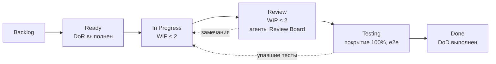

# План работы над NotaCode: Scrum + Kanban (Scrumban)

Статус: черновик v0.1, 23.09.2026. Даты указаны от предположения, что семестр заканчивается около 20.12.2026. Точную дату защиты курсовой нужно уточнить.

## 1. Обоснование выбора Scrumban

| От Scrum | От Kanban |
|---|---|
| Спринт длительностью 1 неделя с фиксированной целью; ритм совпадает с графиком лабораторных работ | Доска с лимитами WIP ограничивает число параллельных задач одного разработчика и агентов |
| Planning, Review, Retro: результат спринта демонстрируется стейкхолдерам | Непрерывный поток: срочные лабы идут через дорожку Expedite |
| Инкремент в конце каждого спринта: рабочий, со 100% покрытием | Метрики потока: lead time, cycle time, CFD |

## 2. Роли

| Роль | Кто | Ответственность |
|---|---|---|
| Product Owner | Ксения | Приоритеты бэклога, приёмка, решения по MVP |
| Разработчик | Ксения + AI-ассистент | Реализация, тесты, документация |
| Scrum Master / Delivery | AI-агент `nc-scrum-master` | Ритм, WIP, препятствия, метрики |
| Review Board | Агенты `nc-*` (архитектор, clean-code-guardian, coverage-guardian, эксперты по нотациям, labs-compliance, security) | Проверка каждого PR до статуса Done |
| Стейкхолдеры | Преподаватели ИТиВП и ИИТ | Требования лаб и курсовой, защита |

## 3. Ритуалы (спринт с понедельника по воскресенье)

| Когда | Событие | Длительность | Результат |
|---|---|---|---|
| Пн | Sprint Planning | 45 мин | Цель спринта, задачи из Ready, оценка в story points |
| Каждый день | Async stand-up (скилл `daily-standup`) | 5 мин | Что сделано, что дальше, что мешает |
| Ср | Backlog Refinement | 30 мин | Истории доводятся до Definition of Ready на 2 спринта вперёд |
| Пт | Sprint Review | 30 мин | Демо инкремента, отчёт по лабе, обновление Ганта |
| Пт | Retrospective | 20 мин | 1–2 улучшения процесса в следующий спринт |

## 4. Kanban-доска



Горизонтальные дорожки:

1. **Expedite** — лаба с ближайшим сроком. Вне WIP-лимита, но не больше одной карточки.
2. **Product** — функционал NotaCode.
3. **Docs / РПЗ** — требования, диаграммы, отчёты, пояснительная записка.
4. **Tech debt & Infra** — CI, Docker, наблюдаемость.

Инструмент: GitHub Projects (вид Board + Roadmap). Колонки совпадают со схемой выше, у каждой карточки есть поля `Estimate`, `Sprint`, `Epic`, `Lab`, `Priority (MoSCoW)`.

## 5. Definition of Ready (DoR)

- Есть история «Как <роль>, я хочу <действие>, чтобы <ценность>» и ссылка на FR/UC.
- Критерии приёмки записаны в формате Given/When/Then.
- Понятны затрагиваемые сервисы и контракты (OpenAPI/AsyncAPI).
- Оценка не больше 8 SP. Если больше — история делится.
- Если задача для лабы — указаны ветка и коммит по методичке (`docs/labs/lab-conditions.md`).

## 6. Definition of Done (DoD)

- Код в `main` через PR, CI зелёный.
- Покрытие **100%** по lines, branches и functions для изменённого пакета.
- **Ноль комментариев** в коде (линтер), ruff/mypy/ESLint/Prettier без замечаний.
- Функция работает целиком, от UI до сервиса: нет «кнопок-пустышек».
- Проверено в светлой и тёмной темах.
- Обновлены документация, OpenAPI и `CHANGELOG.md`.
- Review Board без замечаний уровня High.
- Для лабы: есть отчёт по СТП, скриншоты, ветка и сообщение коммита соответствуют методичке.

## 7. Бэклог: эпики

| Эпик | Содержание | Связь с лабами |
|---|---|---|
| E0 Фундамент | Монорепо, CI, Docker Compose, walking skeleton (web → gateway → language → ответ) | ч.1 ЛР2, ч.2 ЛР8 |
| E1 Gateway и доступ | Express CRUD, Sequelize, JWT, refresh, OAuth GitHub/Google, профиль и настройки | ч.2 ЛР1–3, ПЗ1–2 |
| E2 Язык DSL | Грамматика, парсер, модель, диагностика, source map, каталог нотаций | — |
| E3 Нотации | Профили нотаций волнами, валидация, автоисправления | — |
| E4 Web IDE | Оболочка VS Code, Monaco, панели с изменяемым размером, темы, тосты, статус-бар, терминал и Problems | ч.1 ЛР3–7, ч.2 ЛР4, ПЗ3–4 |
| E5 Холст | SVG-рендер, elkjs, сетка, pan/zoom, подсветка код ↔ элемент | — |
| E6 Версии | Коммиты, история, diff, откат, undo/redo, автосохранение | — |
| E7 Сохранение и интеграции | Устройство, БД, GitHub, Google Drive, статусы push | ч.2 ЛР5 |
| E8 Экспорт и импорт | SVG, PNG, DOT, PlantUML, Mermaid, D2, BPMN XML, XMI, PNML, draw.io, Kroki | — |
| E9 AI | Заглушка, адаптеры провайдеров, режимы, промпты, квоты; позже изображение → DSL | — |
| E10 Реал-тайм и уведомления | Socket.IO, центр уведомлений на MongoDB | ч.2 ЛР6–7 |
| E11 PWA и офлайн | Service Worker, IndexedDB-черновики, очередь синхронизации | ч.1 итоговая |
| E12 Качество и наблюдаемость | Тесты, e2e, Lighthouse ≥ 90, OpenTelemetry, GlitchTip | ч.1 ЛР8 |
| E13 Документация и РПЗ | Требования, диаграммы, руководство, пояснительная записка | курсовая |

## 8. Приоритизация и границы MVP (черновик для утверждения)

MoSCoW. Основа — пометки «MVP» в `source-materials/user-wishlist-mvp.md`.

| Приоритет | Что входит |
|---|---|
| **Must (MVP)** | Редактор DSL с подсветкой и подсказками; Run (рендер только по кнопке); холст с сеткой, zoom/pan; подсветка элемент ↔ строки кода; светлая и тёмная темы; выбор нотации и типа диаграммы; валидация и тосты Error/Warning/OK; Terminal и Problems; шаблоны: просмотр, копирование, вставка в свой файл; вкладка документации; AI-ассистент (заглушка, 4 режима); сохранение на устройство, в БД, GitHub, Google Drive; экспорт SVG, PNG, XML и расширений нотации/кода/проекта; UI по образцу VS Code и draw.io; activity bar (шаблоны, файлы, отладка, терминал, статус, профиль); нотации волны 1 |
| **Should** | Вход и регистрация; история версий, diff, откат; undo/redo; автоисправление (quick fix); импорт; статус-бар целиком; RU/EN |
| **Could** | Автообновление при вводе; автосохранение; нотации волн 2–3; Kroki и альтернативные движки; «Открыть в draw.io»; PWA-офлайн; центр уведомлений; плагины |
| **Won't (сейчас)** | Изображение → диаграмма; редактирование на холсте с записью в код; несколько открытых вкладок; совместная работа; Kubernetes-прод |

**Волны нотаций.** Какие нотации входят в MVP — нужно подтвердить: в файлах ТЗ два разных списка.

- Волна 1 (MVP): UML (class, use case, activity, sequence, state), ERD (Crow's foot, логический и физический уровни), IDEF0, IDEF1X, IDEF3, DFD, «без нотации».
- Волна 2: остальные UML, ERD Chen и уровень концептуальной модели, BPMN process и collaboration.
- Волна 3: сети Петри всех классов, BPMN choreography и conversation.

## 9. Спринты и диаграмма Ганта

Спринт длится 1 неделю. S0 — подготовка.

```mermaid
gantt
  title NotaCode — план спринтов (осень 2026)
  dateFormat YYYY-MM-DD
  axisFormat %d.%m
  section S0 Подготовка
  Документация, требования, архитектура, ADR     :done,   s0a, 2026-09-21, 7d
  Монорепо, CI, Docker Compose, walking skeleton :active, s0b, 2026-09-28, 7d
  section Лабы ч.2
  ЛР1 lab21 Express CRUD (Gateway)               :l1, 2026-09-28, 7d
  ЛР2 lab12 PostgreSQL + Sequelize               :l2, after l1, 7d
  ЛР3 23 JWT + refresh                           :l3, after l2, 7d
  ПЗ1 pz21 EJS / ПЗ2 pz22 REST + Swagger         :p12, after l3, 7d
  ЛР4 24 React state                             :l4, after p12, 7d
  ПЗ3 pz23 Router / ПЗ4 pz24 Context             :p34, after l4, 7d
  ЛР5 25 React ↔ сервер                          :l5, after p34, 7d
  ЛР6 26 MongoDB уведомления                     :l6, after l5, 7d
  ЛР7 27 Socket.IO                               :l7, after l6, 7d
  ЛР8 28 Docker                                  :l8, after l7, 7d
  section Продукт (MVP)
  E2 Язык DSL: грамматика, парсер, диагностика   :e2, 2026-10-05, 14d
  E4 Web IDE: оболочка, Monaco, темы, панели     :e4, 2026-10-05, 21d
  E5 Холст: SVG, elkjs, pan/zoom, подсветка      :e5, after e2, 14d
  E3 Нотации, волна 1                            :e3, after e2, 28d
  E7 Сохранение: устройство, БД, GitHub, Drive   :e7, 2026-10-26, 21d
  E8 Экспорт SVG/PNG/форматы нотаций             :e8, 2026-11-09, 14d
  E9 AI-заглушка, адаптеры, режимы               :e9, 2026-11-16, 14d
  E6 Версии, diff, откат                         :e6, 2026-11-16, 14d
  section Качество и сдача
  E12 Тесты e2e, Lighthouse, наблюдаемость       :q1, 2026-11-23, 14d
  Стабилизация MVP, баг-фикс                     :crit, st, 2026-11-30, 7d
  E13 РПЗ курсовой                               :doc, 2026-11-23, 21d
  Защита курсовой (уточнить дату)                :milestone, def, 2026-12-18, 0d
```

| Спринт | Даты | Цель спринта |
|---|---|---|
| S0 | 21.09–04.10 | Документация готова; skeleton проходит весь путь web → gateway → language; CI со 100% покрытием |
| S1 | 28.09–04.10 | ЛР1: Gateway на Express, CRUD проектов и файлов в памяти |
| S2 | 05.10–11.10 | ЛР2: Sequelize и схема `identity`; старт грамматики DSL и оболочки IDE |
| S3 | 12.10–18.10 | ЛР3: JWT + refresh; парсер с диагностикой, Monaco с маркерами |
| S4 | 19.10–25.10 | ПЗ1–2; SVG-холст, elkjs, первая нотация (UML class) |
| S5 | 26.10–01.11 | ЛР4: состояние редактора; сохранение на устройство и в БД |
| S6 | 02.11–08.11 | ПЗ3–4: маршруты, темы; нотации ERD и IDEF0 |
| S7 | 09.11–15.11 | ЛР5: клиент ↔ сервер; экспорт SVG/PNG, IDEF1X/IDEF3/DFD |
| S8 | 16.11–22.11 | ЛР6: уведомления на MongoDB; AI-заглушка, история версий |
| S9 | 23.11–29.11 | ЛР7: Socket.IO; GitHub и Drive, diff и откат |
| S10 | 30.11–06.12 | ЛР8: Docker; стабилизация MVP, Lighthouse |
| S11 | 07.12–13.12 | РПЗ, руководство пользователя, демо |
| S12 | 14.12–20.12 | Буфер и защита |

## 10. Git-процесс

- `main` — всегда рабочая ветка, прямые коммиты запрещены.
- Ветки лаб называются строго по методичке: `lab21`, `lab12`, `23`…`28`, `pz21`…`pz24`. После защиты сливаются в `main`.
- Продуктовые ветки: `feat/<epic>-<кратко>`, `fix/…`, `docs/…`. Коммиты — Conventional Commits.
- Каждый PR проходит CI (lint, typecheck, тесты, покрытие 100%) и Review Board.
- Версии — SemVer; тег `v0.x.0` на Sprint Review.

## 11. Метрики

| Метрика | Цель |
|---|---|
| Velocity (SP за спринт) | Стабильная; прогноз по 3 последним спринтам |
| Cycle time (In Progress → Done) | ≤ 3 дней на карточку |
| WIP | ≤ 2 In Progress, ≤ 2 Review |
| Burndown спринта | Без «хвоста» больше 20% в последний день |
| CFD | Без разрастания колонки Review |
| Качество | Покрытие 100%, 0 High-замечаний, Lighthouse ≥ 90 |

## 12. Риски процесса

| Риск | Мера |
|---|---|
| Лабы съедают время продукта | Лаба = часть продукта (Gateway, Web). Дорожка Expedite, но не больше одной карточки |
| Распределённая система слишком велика | Walking skeleton в S0, сервисы подключаются по одному; Could-функции уходят за MVP |
| Лимиты бесплатных AI и сессий | AI-заглушка по умолчанию; тяжёлые задачи агентов дробятся |
| Требование 100% покрытия тормозит | TDD с первого дня, чистое доменное ядро, моки портов |
