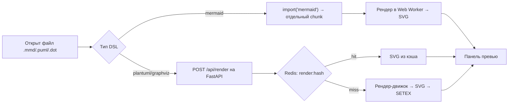

# Модуль 06. Производительность и мониторинг

Цель модуля: научиться измерять и улучшать скорость веб-приложения (Core Web Vitals, оптимизация HTML/CSS/JS/изображений, кэширование, CDN, БД + Redis), отслеживать его состояние в production (Lighthouse, аналитика, error tracking) и держать кодовую базу масштабируемой (архитектурные паттерны, структура проекта, стандарты кодирования, паттерны проектирования, рефакторинг).

---

## Источники

Все файлы из `E:\ИТиВП\Часть 2\Модуль 06. Производительность и мониторинг\` (27 PDF):

| № | Файл | Примечание |
|---|------|-----------|
| 01 | Оптимизация производительности | Титульная страница-заглушка: 1 страница, только заголовок. Открыт оригинал PDF — содержимого нет (это не ошибка извлечения) |
| 02 | Метрики Core Web Vitals и их улучшение | |
| 03 | Оптимизация производительности (продолжение) | |
| 04 | Оптимизация производительности фронтенда | почти дубль 03 (только определения разделов) |
| 05 | Соблюдение стандартов HTML5 для оптимизации кода | |
| 06 | Оптимизация HTML | примеры кода в PDF — картинками, в тексте отсутствуют |
| 07 | Использование семантики и доступности | |
| 08 | Оптимизация JavaScript | примеры кода — картинками |
| 09 | Оптимизация CSS | примеры кода — картинками |
| 10 | Оптимизация изображений | |
| 11 | Оптимизация загрузки | |
| 12 | Отложенная загрузка и кэширование | |
| 13 | Оптимизация запросов к БД и кэширование с Redis | полноценные примеры кода (Node.js + Mongoose + redis) |
| 14 | Методы обеспечения кроссбраузерной совместимости | |
| 15 | Использование CDN | |
| 16 | План оптимизации работы с изображениями, мультимедиа и другими элементами | **единственное практическое задание модуля** (5 шагов + 30 контрольных вопросов) |
| 17 | Время отклика и рендеринга | |
| 18 | Автоматизация задач GRUNT и GULP | |
| 19 | Google Lighthouse для аудита веб-страниц | |
| 20 | Инструменты мониторинга Google Analytics и его альтернативы | |
| 21 | Логирование ошибок (Error Tracking) | |
| 22 | Архитектурные паттерны в веб-разработке | |
| 23 | Структура и масштабируемость проекта | |
| 24 | Стандарты кодирования | |
| 25 | Паттерны проектирования | |
| 26 | Рефакторинг кода | |
| 27 | Вопросы для самоподготовки | 30 вопросов |

**Лабораторной работы в модуле нет** — ни одного файла «Лабораторная работа …» в папке модуля. Единственное задание практического характера — файл 16 («План оптимизации…»), который ссылается на «веб-приложение, разработанное на Лабораторных работах» (т.е. на проект из предыдущих модулей). Он разобран ниже в разделе «Практические занятия».

---

## Ключевая теория

### 1. Core Web Vitals (лекция 02, частично 19)

CWV — три метрики UX от Google; с 2021 г. — фактор ранжирования в поиске.

| Метрика | Что измеряет | Хорошо | Нужно улучшить | Плохо |
|---|---|---|---|---|
| **LCP** (Largest Contentful Paint) | время отрисовки самого крупного элемента во viewport (img, `<image>` в SVG, poster видео, фон через `url()`, текстовый блок) | ≤ 2.5 с | 2.5–4 с | > 4 с |
| **INP** (Interaction to Next Paint) — заменил FID в марте 2024 | задержка от **любого** взаимодействия до следующего кадра (FID учитывал только первое) | ≤ 200 мс | 200–500 мс | > 500 мс |
| **CLS** (Cumulative Layout Shift) | сумма «баллов нестабильности» неожиданных сдвигов = impact fraction × distance fraction | ≤ 0.1 | 0.1–0.25 | > 0.25 |

(В лекции 19 для FID указана цель < 100 мс.)

**Улучшение LCP:** снизить TTFB (быстрый хостинг, серверный кэш Redis/Varnish, оптимизация БД), CDN; современные форматы изображений (WebP/AVIF), сжатие и ресайз; `loading="lazy"` только для изображений ниже первого экрана; `<link rel="preload" as="image" href="hero.jpg">`; инлайн критического CSS в `<style>` в `<head>`; убрать блокирующий JS (`async`/`defer`); клиентское кэширование.

**Улучшение INP:** разбивать long tasks (`setTimeout`, yield в цикл событий); выносить тяжёлые вычисления в Web Workers; минимизировать сторонний код (виджеты, аналитика, реклама); tree shaking, минификация, `async/defer`; лёгкие обработчики событий.

**Улучшение CLS:** всегда задавать `width`/`height` у ``/`<video>` (или `aspect-ratio`), а в CSS `width:100%; height:auto`; резервировать место под баннеры/iframe/виджеты; уведомления и cookie-баннеры — `fixed`/`sticky`, не сдвигая контент; шрифты: `preload` критичных, `font-display: optional` для некритичных, осторожно со `swap` (FOUT/FOIT).

**Инструменты:** PageSpeed Insights (Field Data из CrUX + Lab Data), Google Search Console (сводка по сайту), Lighthouse (лабораторный аудит), DevTools: Performance, Performance Insights, Coverage (неиспользуемый CSS/JS).

**Стратегия:** измерить → приоритизировать (трафик × плохие метрики) → проанализировать (Lighthouse/Performance) → внедрить (сначала изображения и сервер) → контролировать.

Другие метрики (вопрос 10): **FP** (First Paint — первый пиксель), **FCP** (первый контент: текст/изображение), **TTI** (Time to Interactive — страница стабильно отвечает на ввод), TTFB.

### 2. Общая оптимизация фронтенда (лекции 03–04)

Цели: меньше время загрузки, быстрее взаимодействие, меньше нагрузка на сеть и устройство. Сначала **измерение** — Lighthouse, WebPageTest, Chrome DevTools (Network, Performance).

- **Ресурсы и кэширование:** меньше HTTP-запросов; HTTP-заголовки `Cache-Control`, `ETag`, `Last-Modified`; Service Worker для кэша на уровне приложения.
- **Минификация** (удаление пробелов/комментариев, укорачивание имён): Terser (JS), CSSNano (CSS), HTMLMinifier (HTML). **Сжатие** на транспорте: Gzip, Brotli (включается на сервере для текстовых типов).
- **Изображения:** WebP, SVG (иконки/логотипы), AVIF/JPEG 2000; сжатие ImageOptim/TinyPNG/Squoosh; `loading="lazy"`.
- **CSS:** PurgeCSS (удалить неиспользуемое), CSSNano, CSS-модули.
- **Скрипты:** `defer` — загрузка параллельно, выполнение после парсинга HTML в порядке следования; `async` — выполнение сразу по загрузке, порядок не гарантирован; ленивый `import()`.
- **DOM:** reflow (перерасчёт геометрии) и repaint (перерисовка) дороги; батчить изменения, `DocumentFragment`, debounce/throttle; анимировать `transform`/`opacity` вместо `width/height/top/left/margin`.
- **JS:** не блокировать основной поток (`setTimeout`, `requestIdleCallback`), Web Workers, оптимизация циклов.
- **Анимации:** CSS transitions/animations, `will-change`, `requestAnimationFrame` для JS-анимаций.
- **Адаптивность:** медиазапросы, лёгкие анимации и изображения для мобильных сетей.
- **Шрифты и иконки:** woff2/woff, `font-display: swap`, `@font-face`; SVG-иконки/icon fonts.
- **SSR:** сервер отдаёт готовый HTML — быстрее первый показ и лучше SEO (Next.js для React, Nuxt.js для Vue).
- **Лучшие практики:** CDN, клиентский кэш, отложенная загрузка тяжёлых скриптов и изображений, минификация+сжатие, регулярный Lighthouse.

### 3. HTML5, оптимизация HTML, семантика и доступность (лекции 05–07)

**Зачем стандарты HTML5:** кроссбраузерность, SEO, более простой код, доступность.
**Что даёт HTML5:** семантические теги вместо `<div>`-супа и устаревших `<font>`, `<center>`; атрибуты форм `required`, `placeholder`, `min`, `max`, `step` и типы `email`, `date`, `number` (валидация без JS); `<audio>`/`<video>` вместо Flash; `<canvas>` и SVG; `aria-*`, `role`. Документация — MDN, спецификация W3C/WHATWG.

**Оптимизация HTML:**
- Семантика: `<header>`, `<nav>`, `<main>`, `<section>`, `<article>`, `<aside>`, `<footer>`; логичная иерархия `<h1>`…`<h6>` (один `h1`, без пропуска уровней).
- Читаемость: отступы 2/4 пробела, комментарии к секциям, группировка в контейнеры, списки для однотипных элементов.
- Минимализм: без лишних обёрток; осмысленные имена классов (`.header-menu`, а не `.box`); делить большие файлы.
- Минификация HTMLMinifier; `loading="lazy"` для изображений.
- Быстрый поиск/навигация: `<nav>`, якоря `href="#id"`, `<input type="search">`, ARIA.
- SEO: `<title>`, `<meta name="description">`, заголовки, `alt`, микроразметка Schema.org; текстовая релевантность (ключевые слова в заголовках/метатегах, семантика).

**Доступность (a11y):**
- `role` (например `role="button"`), `aria-label` (текст для скринридера), `aria-hidden="true"` (скрыть декоративное).
- `alt` у изображений; `<label for="id">` у полей.
- Контраст текста; фокус и клавиатурная навигация (`tabindex`, Tab-порядок).

```html
<button aria-label="Закрыть диалог">×</button>

```

### 4. Оптимизация JavaScript (лекция 08)

- **Минимизация и сборка:** Webpack (минификация, объединение модулей, code splitting, loaders/plugins), Rollup (библиотеки, ES-модули, хороший tree shaking). В Webpack 5 минификация — `TerserPlugin` в `optimization.minimizer`, режим `mode: 'production'`.
- **Code splitting:** динамический `import()` → бандлер выделяет отдельный chunk, загружаемый по требованию; уменьшает начальный бандл SPA.
- **Lazy loading компонентов (React):**

```jsx
const DiagramPreview = React.lazy(() => import('./DiagramPreview'));
<Suspense fallback={<Spinner/>}><DiagramPreview/></Suspense>
```

- **Асинхронность:** `async/await`, `Promise.all()` для параллельных запросов, `fetch()` вместо XHR.
- **События:** делегирование (один обработчик на родителе, `event.target.closest(...)`); **throttle** — не чаще раза в N мс (scroll, resize); **debounce** — выполнить через N мс после последнего события (поиск/ввод).

```js
const debounce = (fn, ms) => { let t; return (...a) => { clearTimeout(t); t = setTimeout(() => fn(...a), ms); }; };
```

### 5. Оптимизация CSS (лекция 09)

- Удаление неиспользуемого CSS: **PurgeCSS** (сканирует HTML/JS, есть плагин для Webpack/PostCSS); UnCSS (не видит динамически добавляемые классы); PurifyCSS.
- Отзывчивость меньшим кодом: **Flexbox** (одномерный), **CSS Grid** (двумерный) вместо float/таблиц; медиазапросы рядом с соответствующими блоками; относительные единицы `em`, `rem`, `%`.
- Анимации: CSS лучше JS для простых эффектов (`transform`, `opacity`, `color`) — аппаратное ускорение (GPU), не блокирует JS-поток. Не анимировать свойства layout; умеренные длительности; `requestAnimationFrame` для сложных координированных эффектов; ограничивать число анимаций.

### 6. Оптимизация изображений (лекции 10, 16)

- Сжатие: **lossy** (с потерями, JPEG/WebP lossy — меньше размер) и **lossless** (без потерь, PNG/WebP lossless). Инструменты: ImageOptim (macOS), TinyPNG (онлайн + API), JPEGoptim, OptiPNG, Squoosh.
- **WebP**: примерно вдвое компактнее JPEG и на ~30% — PNG (по данным лекции); lossy и lossless, прозрачность, анимация (замена GIF). **AVIF** — ещё лучше сжатие.
- **SVG** — вектор: масштабируется без потерь, мал для логотипов/иконок/схем, стилизуется CSS; растр (JPEG/PNG) — для фото.
- Кроссбраузерная подача через `<picture>` с фоллбэком:

```html
<picture>
  <source srcset="img.avif" type="image/avif">
  <source srcset="img.webp" type="image/webp">
  
</picture>
```

- Адаптивность: `srcset` + `sizes` (браузер выбирает подходящий размер).
- **Lazy loading**: `loading="lazy"` (нативно) — не для above-the-fold (ухудшит LCP); для старых браузеров — полифилл или **Intersection Observer** с `data-src`:

```js
const io = new IntersectionObserver(entries => entries.forEach(e => {
  if (e.isIntersecting) { e.target.src = e.target.dataset.src; io.unobserve(e.target); }
}));
document.querySelectorAll('img[data-src]').forEach(img => io.observe(img));
```

- Видео: `preload="none"`, `poster`, lazy через Intersection Observer; сжатие кодеками (H.264/H.265/VP9/AV1), аудио — AAC/Opus.

### 7. Оптимизация загрузки: запросы и HTTP-кэш (лекция 11)

- **Меньше HTTP-запросов:** CSS-спрайты (одна картинка + `background-position`; минус — любая правка требует пересборки спрайта); объединение CSS/JS в бандлы (минус — изменение одного файла инвалидирует весь бандл); объединение начертаний шрифтов в один запрос.
- **Cache-Control:**
  - `max-age=31536000` — хранить год (для версионированных статик-файлов: изображения, шрифты, бандлы с хэшем в имени);
  - `immutable` — не перепроверять в течение срока жизни;
  - `no-cache` — можно хранить, но перед использованием обязательно ревалидировать на сервере;
  - `no-store` — не хранить вовсе (приватные данные).
- Валидаторы: `ETag` + `If-None-Match`, `Last-Modified` + `If-Modified-Since` → ответ `304 Not Modified`.
- **Service Worker**: фоновый скрипт-посредник, перехватывает `fetch`, кэширует статику (Cache API) при `install`, отдаёт из кэша, даёт офлайн-режим (PWA), обновляет кэш в фоне при смене версии, push-уведомления.

```js
self.addEventListener('install', e => e.waitUntil(caches.open('v1').then(c => c.addAll(['/', '/app.js', '/app.css']))));
self.addEventListener('fetch', e => e.respondWith(caches.match(e.request).then(r => r || fetch(e.request))));
```

### 8. Отложенная загрузка и системы кэширования (лекция 12)

- Lazy loading через Intersection Observer (см. выше): меньше начальная загрузка, экономия трафика, лучше на мобильных.
- **Service Worker**: регистрация `navigator.serviceWorker.register('/service-worker.js')`; **пре-кэширование** (при установке — нужные ресурсы заранее) и **пост-кэширование** (кэш наполняется после первых запросов, runtime caching). Можно кэшировать и ответы API.
- **Типы кэша:** браузерный; серверный — memory cache (Redis, Memcached), disk cache; HTTP-кэш (прокси/веб-сервер, управляется `Cache-Control`, `Expires`, `ETag`).
- **Политики вытеснения:** LRU (удаляются давно не использованные), LFU (удаляются редко используемые).
- **Актуализация:** TTL (время жизни), условные запросы ETag/If-Modified-Since.
- Плюсы: меньше нагрузка на сервер/БД, быстрее ответ, выше масштабируемость.
- **Оптимизация запросов к БД:** индексы (PK/FK, поля фильтрации и сортировки; избыток индексов замедляет INSERT/UPDATE); не `SELECT *`; фильтровать `WHERE`; `JOIN` вместо подзапросов; меньше мелких запросов (JOIN/UNION/IN); параллельное выполнение; кэш запросов СУБД; нормализация (целостность) vs денормализация (скорость агрегаций).
- Комбинирование: горячие данные — в кэш, тяжёлые запросы — индексы и переписывание SQL.

### 9. Оптимизация запросов к БД и Redis (лекция 13)

**Поиск узких мест:** MongoDB `db.setProfilingLevel(1, {slowms:100})`; PostgreSQL `SET log_min_duration_statement = 100;`; замеры в коде (`console.time`); `EXPLAIN ANALYZE` / `.explain()`; PM2 (мониторинг Node), `redis-cli`.

**Приёмы:**
- Индексы, в т.ч. составные: `CREATE INDEX idx_orders_user_created ON orders(user_id, created_at DESC);`
- Проекция — только нужные поля + `limit`.
- **Проблема N+1**: запрос в цикле для каждой записи → заменить на JOIN / `$lookup` / `populate` (в SQLAlchemy — `selectinload`/`joinedload`).
- **Пагинация:** курсорная (`WHERE id > :cursor ORDER BY id LIMIT n+1`) эффективнее офсетной (`OFFSET` сканирует пропущенные строки).

**Redis:** запуск `docker run -d -p 6379:6379 --name redis-cache redis:alpine`. Клиент-обёртка с `set(key, JSON, {EX: ttl})`, `get` + `JSON.parse`, `del`, `exists`; конфиг из env (`REDIS_HOST/PORT/PASSWORD`).

**Стратегии:**
- **Cache-aside (ленивое заполнение):** get из кэша → при промахе читаем БД → кладём в кэш с TTL (можно асинхронно, не блокируя ответ).
- Кэш отдельных записей (`user:{id}`, TTL 1 ч) и списков (`active_users:page:{p}:limit:{l}`, TTL короче — 2–5 мин).
- **Инвалидация** при обновлении: `del` точного ключа + связанных ключей (в лекции — по шаблону `keys(pattern)`; в production лучше `SCAN`, т.к. `KEYS` блокирует Redis).
- Кэш с зависимостями — синхронизировать TTL составного ключа с TTL базового (`ttl`).
- **Redis Hash** (`HSET`/`HGETALL` + `EXPIRE`) для профиля из нескольких частей.
- Метрики кэша: hits, misses, **hit rate** = hits/(hits+misses)·100%.
- Устойчивость: при ошибке Redis — фоллбэк в БД (приложение должно работать без кэша).

**Рекомендации:** сначала мониторинг; индексы — самая эффективная оптимизация; кэшировать не всё; адекватные TTL; обрабатывать ошибки кэша; тестировать стратегии.

### 10. Кроссбраузерность (лекция 14)

- Причины: разные движки — **Blink** (Chrome, Edge, Opera), **WebKit** (Safari), **Gecko** (Firefox); разная поддержка стандартов (например, `gap` во flex, `backdrop-filter`, `scroll-behavior`); пользовательские настройки (масштаб шрифта → использовать `rem/em`); разные UA-стили; разная поддержка тегов (`input type="date"`).
- Решения:
  - **Reset CSS** (обнулить всё) vs **Normalize.css** (сохранить полезное, выровнять различия);
  - `box-sizing: border-box`, простые селекторы, Flexbox/Grid с проверкой по **Can I Use**;
  - **Autoprefixer** (плагин PostCSS, префиксы `-webkit-`, `-moz-`, `-ms-` по данным Can I Use + browserslist);
  - **Modernizr** / feature detection: `if ('IntersectionObserver' in window)`, в CSS — `@supports (display: grid) {…}`;
  - **полифиллы** (core-js, html5shiv, polyfill.io) и **шимы** (альтернатива, если полностью воспроизвести нельзя);
  - **Progressive enhancement** — базовый HTML работает везде, JS/CSS улучшают;
  - **Babel** — транспиляция ES6+ в ES5 (`@babel/preset-env`);
  - тестирование: DevTools (эмуляция устройств), BrowserStack, Sauce Labs, CrossBrowserTesting, эмуляторы (IE Tab); избегать вендор-специфичных свойств; MDN, Can I Use, Lighthouse.

### 11. CDN (лекция 15)

- Распределённая сеть edge-серверов, кэширующих копии контента ближе к пользователю.
- Схема: запрос → ближайший edge → cache hit — отдать сразу; miss/устарело — запрос к **origin**, сохранить, отдать → периодическое обновление.
- Плюсы: скорость (меньше latency), разгрузка origin, отказоустойчивость, безопасность (DDoS-защита, TLS), мобильные сети, экономия инфраструктуры, масштабируемость.
- Контент: статика (изображения, CSS, JS, шрифты), динамика (у современных CDN), медиа (видео/аудио), дистрибутивы и обновления ПО.
- Минусы: стоимость; задержка распространения обновлений (нужна инвалидация/purge или версионирование имён файлов); зависимость от провайдера.
- Провайдеры: Cloudflare, Akamai, Amazon CloudFront, Fastly, KeyCDN (+ Netlify из лекции 16).
- Типичные ошибки интеграции: кэширование приватных ответов, отсутствие версионирования (устаревшие файлы), неверные CORS-заголовки для шрифтов, смешанный контент HTTP/HTTPS.

### 12. Время отклика и рендеринга (лекция 17)

- Конвейер: DOM + CSSOM → Recalculate Style → Layout (reflow) → Paint → Composite. Изменение геометрии вызывает layout+paint, изменение цвета — только paint, `transform`/`opacity` — только composite.
- Минимизация: меньше изменений DOM, `DocumentFragment`, батчинг операций, CSS-анимации вместо JS, `transform/opacity`.
- Анализ: DevTools → **Performance** → запись → события *Recalculate Style*, *Layout*, *Paint*; раздел Frames — время на кадр.
- **requestAnimationFrame** — колбэк перед следующей отрисовкой, синхронно с частотой экрана: анимации, визуальные обновления.
- **requestIdleCallback** — фоновые низкоприоритетные задачи в простое браузера (кэширование, предзагрузка); не поддерживается в Safari, выполнение не гарантировано → нужен фоллбэк/`timeout`.
- Подходы: ограничение частоты рендеринга, **Virtual DOM** (React/Vue применяют минимальный diff), debounce/throttle, Web Workers.

### 13. Автоматизация задач: Grunt и Gulp (лекция 18)

- Назначение: минификация JS/CSS/изображений, компиляция Sass/Less, конкатенация, автотесты, watch.
- **Grunt** — конфигурационный подход (`Gruntfile.js`, `grunt.initConfig({...})`, `loadNpmTasks`, `registerTask`), множество плагинов (например `grunt-contrib-cssmin`).
- **Gulp** — код и **потоки** (streams): `src().pipe(plugin()).pipe(dest())`; быстрее и гибче.

```js
const { src, dest } = require('gulp'); const cleanCSS = require('gulp-clean-css');
exports.css = () => src('src/*.css').pipe(cleanCSS()).pipe(dest('dist'));
```

- Сейчас их функции в основном взяли бандлеры (Webpack, а для NotaCode — **Vite**/Rollup).

### 14. Google Lighthouse (лекция 19)

- Open-source аудит по категориям: **Performance** (FCP, LCP, TBT/FID, CLS, Speed Index), **Accessibility** (alt, контраст, фокус, ARIA), **SEO** (title/description, семантика, sitemap, robots.txt, URL), **Best Practices** (HTTPS, заголовки, уязвимые библиотеки), **PWA** (service worker, офлайн, установка). (В новых версиях Lighthouse категория PWA удалена, но в курсе она есть.)
- Запуск: DevTools (Ctrl+Shift+I → Lighthouse → категории → Generate report); CLI: `npm i -g lighthouse` → `lighthouse https://site --output html --view`; **Lighthouse CI** (`@lhci/cli`) в пайплайне; расширение Chrome.
- Отчёт: оценки 0–100 по категориям + метрики + рекомендации («Opportunities», «Diagnostics»).
- Цели: LCP < 2.5 с, FID < 100 мс, CLS < 0.1; Accessibility < 80 — сигнал к исправлениям.

### 15. Аналитика: Google Analytics и альтернативы (лекция 20)

- **GA4** — событийная модель (каждое действие — событие с параметрами) вместо сессионной; ML-прогнозы (отток, доход); веб + мобильные приложения; бесплатно. Минусы: GDPR (данные в США), сложность настройки, семплирование в сложных отчётах.
- Альтернативы:
  - **Matomo** — open source, self-hosted или SaaS, полный контроль данных, похож на классический GA, e-commerce, heatmaps;
  - **Open Web Analytics** — лёгкий self-hosted, только базовые метрики;
  - **Яндекс.Метрика** — бесплатно, **Вебвизор** (запись сессий); данные не совпадают с GA;
  - **Simple Analytics / Fathom** (и Plausible из вопросов) — privacy-first, без cookies и баннеров, платные, урезанный функционал;
  - **Countly** — продуктовая аналитика (воронки, когорты, офлайн-события).
- Технический мониторинг скорости: Lighthouse (аудит по запросу), PageSpeed Insights (Lighthouse + CrUX), WebPageTest (разные локации, устройства, скорости сети).
- **Мониторинг vs аналитика:** мониторинг отвечает на вопрос «работает ли и насколько быстро» (метрики, ошибки, аптайм), аналитика — «что делают пользователи» (события, источники, конверсии).

### 16. Error Tracking (лекция 21)

- Аналитика говорит «что произошло», error tracking — «почему сломалось», без ожидания жалоб.
- **Sentry**: SDK перехватывает необработанные исключения и unhandled rejections, собирает stack trace, браузер/ОС, пользователя, **breadcrumbs** (последовательность действий до ошибки), релиз и окружение; **source maps** разворачивают минифицированный код в исходный; интеграции GitHub/Jira/Slack.

```js
import * as Sentry from '@sentry/react';
Sentry.init({ dsn: import.meta.env.VITE_SENTRY_DSN, environment: 'production', tracesSampleRate: 0.1 });
```

(В лекции пример с `@sentry/browser` и устаревшим `new Sentry.Integrations.Breadcrumbs`; в актуальных SDK интеграции подключаются функциями.)

- Альтернативы: **LogRocket** (запись сессии как последовательности DOM-событий), **TrackJS** (только фронтенд, лёгкий), **Rollbar**, **Bugsnag**, **GlitchTip** (open-source, совместим с Sentry SDK).
- Практики: уровни (`error`/`warn`/`info`); контекст (`userId`, timestamp); try/catch вокруг критичных операций + `Sentry.captureException(err)`; асинхронная отправка (не мешать UX); не засорять консоль в production — логгер с уровнями по окружению.
- Серверная сторона (вопросы 17–20): логи бэкенда (Node: winston, morgan; Python: `logging`, structlog, loguru); метрики CPU/RAM/латентности — **Prometheus + Grafana**; **healthcheck**-эндпоинт `/health` для оркестраторов (Docker/Kubernetes liveness/readiness, балансировщики); uptime-мониторинг — UptimeRobot, Better Stack.

### 17. Архитектурные паттерны (лекция 22)

| Паттерн | Суть | Плюсы | Минусы | Когда |
|---|---|---|---|---|
| **Монолит** | всё — одно развёртываемое приложение | простота, быстрые внутрипроцессные вызовы | разрастание, связанность, масштабируется целиком, один стек | малые проекты, старт |
| **Клиент-сервер** | браузер ↔ HTTP ↔ сервер | основа веба | — | всегда |
| **SSR** классический (PHP, Rails, Django) / современный (Next, Nuxt, с гидратацией) | HTML формирует сервер | быстрый первый показ, SEO | перезагрузки (классика), нагрузка на сервер | контентные сайты |
| **CSR (SPA)** | пустой HTML + JS, данные по API | богатый UI, сервер = API, разделение фронт/бэк | медленная первая загрузка, SEO | дашборды, админки, SaaS |
| **Layered / N-tier** | Presentation → Business Logic → Data Access | разделение ответственности | больше кода | большинство бизнес-приложений |
| **MVC / MVP / MVVM** | Model, View, Controller (Presenter/ViewModel с data binding) | разделение UI и логики | — | UI, серверные фреймворки |
| **Микросервисы** | независимые сервисы по доменам, своя БД; Docker/K8s, REST/GraphQL, Kafka/RabbitMQ | независимость команд, точечное масштабирование, устойчивость, разные стеки | сложность, сетевые накладные расходы, распределённая согласованность | крупные системы, несколько команд |
| **Event-Driven** | producer → broker (Kafka, RabbitMQ) → consumer | слабая связанность, масштабируемость | сложная отладка | асинхронные процессы |
| **Serverless / FaaS** | функции в AWS Lambda / Cloud Functions | нет администрирования, автомасштаб, оплата за вызовы | cold start, лимиты времени, vendor lock-in | event-задачи, API |

Выбор: размер и сложность, команда (есть ли DevOps), рост нагрузки, сроки, важность SEO. **Золотое правило:** начинать с монолита/слоёв и выделять сервисы, когда архитектура реально мешает.

### 18. Структура и масштабируемость проекта (лекция 23)

- Разделять код по назначению; для малых проектов — папки `images/`, `fonts/`, `styles/`, `scripts/`; для React/Vue — компонентная структура.
- Принципы: слои (MVC/MVVM), паттерны управления состоянием (**Flux/Redux**), **component-based**; модульность, переиспользуемость, изоляция логики от UI (**container / presentational**), низкая связанность (API-запросы в `services/api.js`, состояние — Redux/Context).
- Типичная React-структура: `src/components/`, `pages/`, `hooks/`, `services/`, `store/`, `utils/`, `assets/`, `styles/`.
- Типы компонентов: функциональные, контейнерные (состояние и логика), презентационные (только пропсы → UI).
- Стили: **CSS-in-JS** (styled-components, emotion — изоляция, динамические темы); **препроцессоры** SCSS/SASS/LESS (переменные, вложенность, миксины, партиалы через `@use/@import`); **PostCSS** (плагины: autoprefixer, cssnano); **CSS-модули** (`Button.module.css` → уникальные классы, нет конфликтов имён).

### 19. Стандарты кодирования (лекция 24)

- Кодстайл: форматирование, именование, организация, единообразие конструкций. **Линтинг** — автоматическая проверка.
- **ESLint** (`npm i -D eslint`, `npx eslint --init`, `.eslintrc.*` / flat config `eslint.config.js`, `npx eslint src`); **Prettier** (`.prettierrc`, `npx prettier --write .`); связка через `eslint-config-prettier` (отключает конфликтующие правила) + `eslint-plugin-prettier`; **Stylelint** (`.stylelintrc.json`, `npx stylelint "**/*.css"`).
- Читаемость: описательные имена (`userAge`, а не `x`), функции — с глагола (`getUserData`), семантичные CSS-классы (`.btn-primary`), единый стиль (camelCase/kebab-case); стрелочные функции (лексический `this`) vs обычные (методы, явный `this`); **TypeScript** и дескрипторы свойств (`Object.defineProperty`); комментарии, README, **JSDoc**; маленькие функции с одной задачей.
- Линтеры в CI/CD (например, GitHub Actions: checkout → setup-node → `npm ci` → `npm run lint`) — проверка до слияния в основную ветку.

### 20. Паттерны проектирования (лекция 25)

GoF-классификация: **порождающие** (Singleton, Factory, Builder, Prototype), **структурные** (Adapter, Decorator, Facade, Proxy), **поведенческие** (Observer, Strategy, Command, Iterator).

| Паттерн | Задача | Пример в вебе |
|---|---|---|
| Singleton | единственный экземпляр + глобальная точка доступа | логгер, пул подключений к БД, конфиг; минус — глобальное состояние мешает тестам |
| Factory Method | создание объектов разных типов с общим интерфейсом | уведомления email/SMS/push; фабрика React-компонентов по типу |
| Builder | пошаговая сборка сложного объекта (fluent-цепочка) | QueryBuilder SQL, конфигурация HTTP-клиента |
| Adapter | приведение чужого интерфейса к ожидаемому | XML → JSON, snake_case → camelCase |
| Decorator | динамическое добавление поведения | логирование/кэш; HOC `withAuth(Component)`; Python-декораторы; альтернатива в React — кастомные хуки |
| Proxy | контроль доступа (кэш, ленивая загрузка, права) | ApiProxy с Map-кэшем; ES6 `Proxy` |
| Observer | подписка и уведомление | `EventEmitter`, `addEventListener`, Redux-подписки, Context |
| Strategy | взаимозаменяемые алгоритмы | способы оплаты, сортировка asc/desc, валидация |
| Command | запрос как объект (очередь, лог, undo) | undo/redo в редакторах, Redux actions |

Архитектурные: MVC, MVVM, **Repository** (абстракция над БД), **Dependency Injection** (Angular, NestJS; в FastAPI — `Depends`), **Middleware / Chain of Responsibility** (Express, Redux middleware). React-специфичные: Container/Presentational, Render Props, HOC, Custom Hooks.
Выбор: частые изменения алгоритма → Strategy; много похожих объектов → Factory/Builder; расширение функций → Decorator; слабая связность → Observer/Mediator. Излишнее применение паттернов — антипаттерн.

### 21. Рефакторинг (лекция 26)

- Изменение внутренней структуры **без изменения внешнего поведения**; не чинит баги и не добавляет фичи. Цели: читаемость, отладка, скорость разработки, снижение технического долга.
- Когда: перед новой функцией, после багфикса, на code review, при «запахах».
- **Code smells** → решение: длинный метод (> 20–30 строк) → разбить; большой класс → выделить классы; дублирование → общая функция; много поясняющих комментариев → переименовать/разбить; «завистливая функция» → перенести в класс данных; цепочки `a.getB().getC()` → делегирование / закон Деметры; сложные условия → полиморфизм/таблица стратегий; временное поле → отдельный класс; отказ от наследства → композиция.
- Техники: Extract Method, Rename, Inline Method, магическое число → константа, замена условия полиморфизмом, Extract Class, удаление дублирования; в React — извлечение компонента, вынос логики в кастомный хук, ранний `return` вместо цепочки условных рендеров.
- Инструменты: IDE (VS Code, WebStorm), ESLint, Prettier, тесты (Jest).
- Процесс: тесты зелёные → маленький шаг → тесты → коммит → повторить.
- Не рефакторить: стабильный неизменяемый код, дорогие переделки без пользы, код без тестов (сначала тесты), перед релизом.

---

## Лабораторные работы

**В модуле 06 лабораторных работ нет** (проверено: в папке модуля нет ни одного файла лабораторной работы; все 27 файлов — лекции, одно практическое задание-план и вопросы для самоподготовки).

## Практические занятия

### Практическое задание: «План оптимизации работы с изображениями, мультимедиа и другими элементами» (файл 16)

- **Срок:** срок не указан в материалах.
- **Цель:** изучить и применить методы оптимизации изображений/мультимедиа, lazy loading, CDN и сжатие данных к веб-приложению, созданному на лабораторных работах курса, и составить план его оптимизации.
- **Объект:** «ваше веб-приложение, разработанное на Лабораторных работах» (т.е. сквозной проект — для студентки это NotaCode).
- **Стек/инструменты:** не навязан; названы ImageOptim, TinyPNG, Squoosh, форматы WebP/AVIF/SVG, атрибут `loading="lazy"`, CDN (Cloudflare, AWS CloudFront, Netlify), Gzip, Brotli.
- **Варианты:** не предусмотрены.
- **Формат отчёта / критерии оценки:** в материалах не указаны (фактическим результатом является применённая оптимизация + письменный план; ответы на контрольные вопросы — на защите).

**Шаги (по порядку):**

1. **Изучение методов оптимизации изображений и мультимедиа**
   - форматы JPEG, PNG, WebP, AVIF — плюсы и минусы;
   - сжатие lossy vs lossless, как сжимать без видимой потери качества;
   - векторная графика SVG — где уместна;
   - мультимедийные форматы (видео, аудио) и их оптимизация (сжатие, кодеки).
2. **Применение методов оптимизации изображений в своём приложении**
   - перевести изображения в WebP/AVIF вместо JPEG/PNG;
   - сжать изображения;
   - логотипы/иконки — в SVG;
   - опробовать ImageOptim, TinyPNG, Squoosh на изображениях проекта.
3. **Ленивая загрузка**
   - внедрить `loading="lazy"` для ``;
   - исследовать способы lazy loading для видео и других медиа;
   - протестировать влияние на скорость загрузки и общую производительность (замеры до/после).
4. **CDN и сжатие данных**
   - изучить концепцию CDN и способ интеграции (Cloudflare, AWS CloudFront, Netlify);
   - изучить Gzip и Brotli и внедрить сжатие статических файлов (CSS, JS);
   - оценить улучшение скорости загрузки после внедрения сжатия.
5. **Разработка плана оптимизации веб-приложения**
   - оценить, какие методы применимы к проекту;
   - проанализировать, какие элементы требуют оптимизации (изображения, шрифты, мультимедиа, скрипты, стили);
   - оценить эффект CDN, сжатия, ленивой загрузки и других методов на производительность.

**Контрольные вопросы (30):**
1. Наиболее эффективные форматы изображений для скорости и почему.
2. Lossy vs lossless — различие.
3. Как использовать WebP, его преимущества.
4. SVG vs растровые (JPEG, PNG).
5. Что такое Lazy Loading и как он помогает.
6. Как добавить `loading="lazy"` в ``.
7. Проблемы при внедрении lazy loading.
8. Инструменты сжатия изображений без потери качества.
9. Современные методы сжатия данных (Gzip, Brotli).
10. Как использовать Gzip/Brotli для сжатия файлов «на клиенте».
11. Как CDN ускоряет загрузку, популярные CDN.
12. Как выбрать CDN.
13. Принцип работы CDN и влияние на производительность.
14. Ошибки при интеграции CDN.
15. Как определить, какие ресурсы требуют оптимизации.
16. Синхронная vs асинхронная загрузка ресурсов.
17. Преимущества WebP/AVIF.
18. Инструменты анализа производительности.
19. Как уменьшить CSS/JS без потери функциональности.
20. Почему SVG бывает предпочтительнее растра.
21. Инструменты сжатия видео и аудио.
22. Плюсы и минусы сжатых изображений.
23. Оптимизация шрифтов.
24. Настройка кэширования статики (CSS, JS, изображения).
25. Критический CSS для ускорения рендеринга.
26. Оптимизация асинхронной/отложенной загрузки скриптов.
27. Использование `srcset` для адаптивных изображений.
28. Эффект CDN для глобальных пользователей.
29. Как уменьшить время первого рендеринга.
30. Как минимизировать время до первого интерактивного состояния (TTI).

Краткие опорные ответы: (9–10) сжатие делает сервер/CDN/сборка — Vite-плагин `vite-plugin-compression` генерирует `.gz`/`.br`, браузер декодирует по `Content-Encoding` после заголовка `Accept-Encoding`; (21) FFmpeg (H.264/H.265/VP9/AV1, AAC/Opus), HandBrake; (25) инлайн стилей первого экрана в `<head>`, остальное — асинхронно; (27) `srcset="a-480.webp 480w, a-960.webp 960w" sizes="(max-width:600px) 480px, 960px"`; (29–30) SSR/пререндер, preload ключевых ресурсов, code splitting, `defer`, меньше JS в main thread.

---

## Вопросы для самоподготовки

**Оптимизация производительности**
1. Три метрики Core Web Vitals (LCP, FID→INP, CLS) — что измеряют.
2. Измерение времени загрузки через DevTools Performance и Lighthouse.
3. Методы оптимизации изображений (WebP/AVIF, сжатие, lazy loading).
4. HTTP-кэширование; заголовки Cache-Control, ETag, Last-Modified.
5. CDN — что это и как ускоряет статику.
6. Минификация и сжатие gzip/brotli.
7. Code splitting и его влияние на начальную загрузку SPA.
8. Render-blocking ресурсы; `async` и `defer`.
9. Оптимизация веб-шрифтов (woff2, `font-display: swap`).
10. FP, FCP, TTI — что это и зачем отслеживать.

**Мониторинг и аналитика**
11. Технический мониторинг vs пользовательская аналитика.
12. Что собирает GA; событийная модель GA4.
13. Бесплатные аналоги GA (Яндекс.Метрика, Matomo, OWA, Plausible) и их особенности.
14. Зачем собирать ошибки на клиенте и сервере; Sentry, GlitchTip.
15. Интеграция Sentry в React; какие данные передаёт (стек, контекст, браузер, действия).
16. Source maps и отладка минифицированного кода.
17. Логи на бэкенде; библиотеки Node.js (winston, morgan).
18. Метрики сервера (CPU, память, время ответа); Prometheus + Grafana.
19. Healthcheck (`/health`) и зачем он оркестраторам.
20. Uptime-мониторинг (UptimeRobot, Better Stack).

**Архитектурные паттерны**
21. Монолит: плюсы и минусы.
22. Микросервисы: преимущества и сложности.
23. Когда начинать с монолита, когда переходить на микросервисы.
24. MVC — роли Model, View, Controller.
25. Singleton — где полезен (подключение к БД).
26. Observer — где встроен (EventEmitter, addEventListener).
27. Factory — пример уведомлений email/SMS.
28. Decorator — HOC в React, декораторы TS/Python.
29. Рефакторинг и признаки «дурного запаха».
30. Техники рефакторинга (Extract Method, Rename, удаление дублирования, полиморфизм вместо условий).

---

## Как применить в проекте NotaCode

### Требования модуля к стеку

- Лабораторных работ нет → **обязательных технологий модуль не навязывает**. Практическое задание (файл 16) технологически нейтрально: нужны оптимизация изображений, lazy loading, CDN, Gzip/Brotli и письменный план — всё реализуемо на React + Vite + PWA и Python FastAPI.
- Примеры лекции 13 написаны на Node.js + Mongoose + пакет `redis`, но это иллюстрации, а не требование. Прямого разрешения на замену нет, но и запрета нет; в NotaCode те же приёмы реализуются на Python (`redis.asyncio`, SQLAlchemy). **Node.js BFF для этого модуля не нужен.** Если преподаватель захочет увидеть именно JS-код Redis-кэша, можно показать тонкий Node/Express-прокси рендера, но смысла в этом мало — лучше обосновать эквивалентность.
- Lighthouse CI, ESLint/Prettier/Stylelint, Sentry — JS-инструменты фронтенда, в React-части используются как есть; для бэкенда аналоги — Ruff/Black/mypy, `sentry-sdk[fastapi]`.

### Как выполнить практическое задание (файл 16) на NotaCode

| Шаг задания | Реализация в NotaCode |
|---|---|
| Форматы и сжатие | Иллюстрации лендинга и скриншоты-примеры → AVIF/WebP через `<picture>` с PNG-фоллбэком; пакетное сжатие `vite-plugin-image-optimizer` (sharp/svgo) или Squoosh CLI; иконки PWA — PNG нужных размеров (192/512) + maskable; UI-иконки и логотип — SVG (lucide/свой спрайт). |
| SVG | Сами диаграммы — SVG (вектор, масштабирование без потерь в превью и при экспорте); прогонять серверный SVG через svgo (удаление метаданных, округление координат). |
| Lazy loading | `loading="lazy"` + `width/height` для миниатюр проектов в дашборде; Intersection Observer для рендера превью диаграмм в списке проектов/галерее шаблонов только при появлении в viewport; демо-видео на лендинге — `preload="none"` + `poster`. |
| CDN и сжатие | Статика Vite (`dist/assets/*.[hash].js/css`) — через Cloudflare/Netlify/CloudFront с `Cache-Control: public, max-age=31536000, immutable`; `index.html` и `sw.js` — `no-cache`; сжатие: предварительные `.br`/`.gz` через `vite-plugin-compression` + отдача Nginx (`brotli_static on; gzip_static on;`), для API — `GZipMiddleware` FastAPI (SVG хорошо сжимается, JSON тоже). |
| Замеры и план | Lighthouse (DevTools + `lhci autorun` в GitHub Actions) до/после; WebPageTest с throttling 4G; таблица «элемент → проблема → метод → ожидаемый эффект → результат» (изображения, шрифты, JS-бандлы редактора, рендер-движки, CSS). |

### Целевые показатели Lighthouse / CWV для IDE

| Страница | LCP | INP | CLS | Lighthouse Perf / A11y / BP / SEO |
|---|---|---|---|---|
| Лендинг, публичная ссылка на диаграмму (`/s/{token}`) | ≤ 2.0 с | ≤ 200 мс | ≤ 0.05 | ≥ 90 / ≥ 95 / ≥ 95 / ≥ 95 |
| Редактор (`/app/project/:id`) | ≤ 2.5 с (скелет редактора + последний SVG из кэша) | ≤ 200 мс при наборе текста | ≤ 0.1 | ≥ 80 / ≥ 90 / ≥ 95 / — |

Дополнительные бюджеты: начальный JS ≤ 200 КБ gzip (без Monaco/Mermaid), ответ `POST /render` из кэша ≤ 50 мс p95, холодный рендер ≤ 800 мс p95. Бюджеты закрепить в `lighthouserc.json` (`assertions`), сборку валить при регрессии.

Специфика IDE для INP: ввод в редакторе не должен блокироваться рендером — **debounce 300–500 мс** на отправку DSL, парсинг/рендер Mermaid в **Web Worker** (или на сервере), отмена устаревших запросов через `AbortController`; для CLS — фиксированный размер панели превью, `aspect-ratio` у миниатюр, скелетоны.

### Ленивая загрузка рендереров диаграмм (code splitting)

Mermaid, Monaco/CodeMirror, ELK-layout, экспорт PDF — тяжёлые пакеты. Загружать по требованию:



```ts
const renderers = {                       // Strategy + ленивый Factory
  mermaid:  () => import('./renderers/mermaid'),
  plantuml: () => import('./renderers/remote'),
  graphviz: () => import('./renderers/remote'),
} as const;
export async function getRenderer(kind: keyof typeof renderers) {
  return (await renderers[kind]()).default;
}
const Editor = lazy(() => import('./features/editor/EditorPage'));   // route-level split
```

В `vite.config.ts` — `build.rollupOptions.output.manualChunks` для выделения `mermaid`, `monaco` в отдельные чанки; `<link rel="modulepreload">` для редактора при наведении на карточку проекта (prefetch по намерению). Service Worker (vite-plugin-pwa/Workbox): precache оболочки приложения, runtime cache `CacheFirst` для чанков рендереров, `StaleWhileRevalidate` для `GET /api/projects`, офлайн-редактирование с отложенной синхронизацией.

### Кэширование отрендеренного SVG (Redis + HTTP-кэш)

- **Ключ содержимого:** `render:{engine}:{engine_version}:{theme}:{sha256(dsl)}` — одинаковый текст даёт тот же SVG, поэтому кэш детерминирован и не требует инвалидации при правках (новый текст → новый ключ). Версия движка в ключе = инвалидация при апгрейде.
- **Cache-aside в FastAPI:**

```python
async def render_svg(req: RenderIn, redis: Redis = Depends(get_redis)) -> Response:
    key = f"render:{req.engine}:{ENGINE_VER[req.engine]}:{req.theme}:{sha256(req.source.encode()).hexdigest()}"
    try:
        if (svg := await redis.get(key)) is not None:
            metrics.hit(); return svg_response(svg, key)
    except RedisError:
        log.warning("redis unavailable, fallback")   # приложение работает без кэша
    metrics.miss()
    svg = await renderer_for(req.engine).render(req.source, req.theme)  # Strategy
    with suppress(RedisError):
        await redis.set(key, svg, ex=7 * 24 * 3600)  # TTL 7 дней, maxmemory-policy allkeys-lru
    return svg_response(svg, key)
```

- **HTTP-кэш:** `GET /api/render/{hash}.svg` → `ETag: "{hash}"`, `Cache-Control: public, max-age=31536000, immutable` (контент-адресуемый URL) — кэшируется браузером, Service Worker'ом и CDN. Для публичных ссылок `/s/{token}.svg` — `max-age=300, stale-while-revalidate=86400` + `ETag` → `304 Not Modified`; при смене прав доступа — purge в CDN. Приватные проекты — `Cache-Control: private` (не кэшировать на CDN!).
- **Кэш данных:** `project:{id}` и `user:{id}:projects:page:{n}` с TTL 2–5 мин; инвалидация при `PUT/DELETE` через `DEL` точных ключей (без `KEYS`, при необходимости — `SCAN` или версия-счётчик в ключе `projects:v{n}`).
- **Метрики:** hit rate рендер-кэша в Prometheus (`render_cache_hits_total`, `render_cache_misses_total`), дашборд Grafana.
- **БД (PostgreSQL + SQLAlchemy):** индексы `files(project_id, updated_at DESC)`, `projects(owner_id)`, `shares(token) UNIQUE`; `selectinload(Project.files)` против N+1; курсорная пагинация списка проектов (`?cursor=<updated_at,id>`); `EXPLAIN ANALYZE` и `log_min_duration_statement = 100` в dev.
- **Rate limit** на рендер (дорогая операция) — тот же Redis (`INCR` + `EXPIRE`).

### Error tracking (Sentry) и мониторинг

- **Фронтенд:** `@sentry/react` + `Sentry.ErrorBoundary` вокруг панели превью и редактора (ошибка рендера не роняет всё приложение); `browserTracingIntegration` + web-vitals (реальные LCP/INP/CLS пользователей); загрузка source maps при сборке через `@sentry/vite-plugin` (сами `.map` не публиковать); `release` = git SHA; breadcrumbs: «открыт проект → изменён файл → запрос /render».
- **Ошибки парсинга DSL** — не исключения, а ожидаемый пользовательский результат: показывать в редакторе (маркеры строк), в Sentry не слать (фильтр `beforeSend`), считать метрикой.
- **Бэкенд:** `sentry-sdk[fastapi]` (интеграции FastAPI/SQLAlchemy/Redis), `traces_sample_rate=0.1`, тег `engine`, контекст `user.id` (без email — приватность); таймауты/падения рендер-движков → `capture_exception`. Self-hosted альтернатива — **GlitchTip** (совместим с Sentry SDK).
- **Логи:** структурированный JSON (`structlog`) с `request_id`, уровни по окружению; **`GET /health`** (liveness) и **`GET /ready`** (проверка PostgreSQL + Redis) для Docker/Kubernetes; UptimeRobot/Better Stack на `/health` и лендинг.
- **Аналитика:** privacy-first (Plausible/Matomo self-hosted), события: `diagram_rendered`, `project_created`, `share_link_created`, `export_png`; не путать с техническим мониторингом.

### Применение архитектурных паттернов и практик кода

- **Архитектура:** CSR SPA (редактор — SEO не критичен) + пререндер/SSR только для лендинга и публичных страниц диаграмм (SEO, быстрый LCP). Бэкенд — **модульный монолит с слоями** (routers → services → repositories → models) по «золотому правилу»; рендер-движки (PlantUML/Graphviz) выделяются в отдельный воркер/контейнер, когда появится нагрузка — первый кандидат в сервис; тяжёлый экспорт (PDF, пакетный) — через очередь (Redis/RQ/Celery = event-driven).
- **Repository** для `ProjectRepository`, `FileRepository`; **Dependency Injection** через `Depends` (сессия БД, Redis, текущий пользователь); **Middleware** (CORS, GZip, request-id, логирование); **Strategy** — рендереры по типу DSL; **Factory** — `renderer_for(engine)` и экспортеры (SVG/PNG/PDF); **Adapter** — нормализация ответов разных движков и snake_case → camelCase для фронта (`alias_generator` в Pydantic); **Decorator** — `@cached(ttl=...)`, `@require_permission("edit")`; **Proxy** — кэширующий прокси над рендер-движком; **Observer** — WebSocket-рассылка изменений совместного редактирования; **Command** — undo/redo операций над деревом проекта (переименование, перемещение файлов); **Singleton** — пул подключений к Redis/БД на уровне lifespan приложения.
- **Структура фронтенда:** `src/features/{editor,projects,auth,share}/`, `src/components/` (презентационные), `src/hooks/` (`useDebouncedRender`, `useProject`), `src/services/api.ts`, `src/renderers/`, `src/store/`; стили — CSS-модули + PostCSS (autoprefixer, cssnano), browserslist для Babel/автопрефиксов.
- **Стандарты:** ESLint (flat config, `typescript-eslint`, `react-hooks`) + Prettier + Stylelint на фронте; Ruff + Black + mypy на бэке; husky/lint-staged (pre-commit); GitHub Actions: lint → tests → build → Lighthouse CI.
- **Рефакторинг:** крупный `EditorPage` → компоненты `FileTree`, `CodePane`, `PreviewPane` + хук `useDebouncedRender`; условные ветки по типу DSL → таблица стратегий; магические числа (debounce 400 мс, TTL) → константы в конфиге; каждый шаг под тестами (Vitest, pytest).
- **Кроссбраузерность:** проверить Safari (WebKit) — `requestIdleCallback` отсутствует (фоллбэк на `setTimeout`), поведение SVG `foreignObject` в Mermaid; `@supports` для `backdrop-filter`; Playwright-тесты в Chromium/Firefox/WebKit.
- **Доступность:** дерево файлов с `role="tree"`/`treeitem`, клавиатурная навигация, `aria-label` у иконочных кнопок, `alt`/`<title>` и `<desc>` у экспортированного SVG, контраст тем редактора.

---

## Нечитаемые материалы

Нечитаемых файлов нет. Примечания:
- `01. Оптимизация производительности.pdf` — открыт оригинал: единственная страница содержит только заголовок и подзаголовок «Оптимизация производительности» (вводный слайд-заглушка). Содержательной информации в файле нет, дело не в извлечении текста.
- В лекциях 03, 06, 08, 09, 11, 12, 14, 17, 18, 23, 24 после слов «Пример:» в извлечённом тексте кода нет (судя по всему, код вставлен в PDF изображениями); окружающее описание извлечено полностью, и нужные идиомы восстановлены в конспекте по смыслу (собственными примерами).
